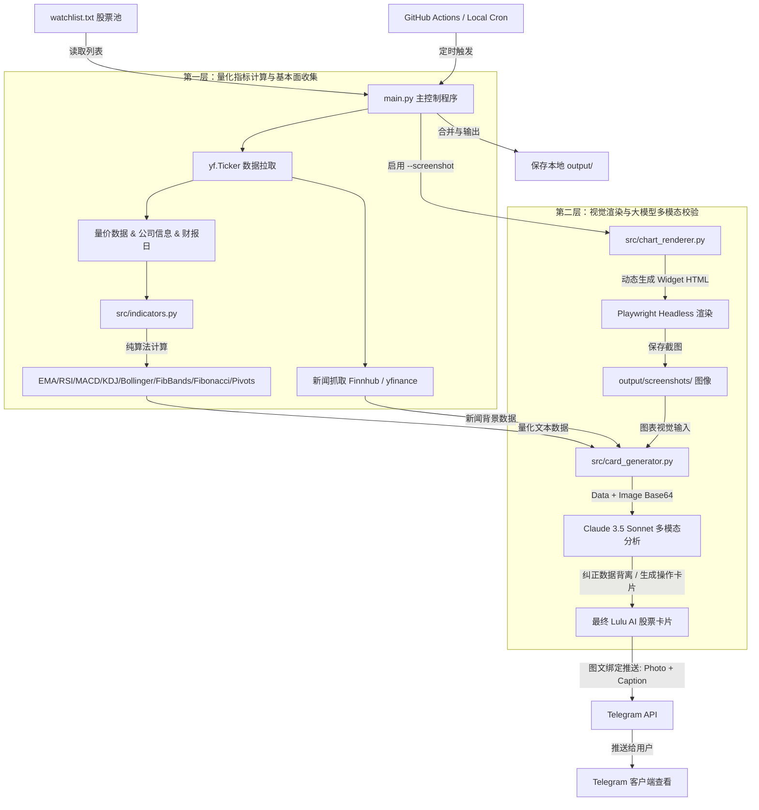

# 📊 Lulu AI Stock Card Bot

**Lulu AI Stock Card Bot** 是一个智能美股量化分析与交易决策助手。它能够在每个工作日的关键交易时段（开盘、盘中、收盘前）自动拉取美股行情数据，计算全套技术指标，抓取最新市场新闻，并自动生成高清 TradingView 图表截图。最后，系统利用大语言模型（Claude）进行多模态视觉核对与综合分析，生成结构化、图文并茂的“Lulu 股票卡片”推送到您的 Telegram 频道或群聊中。

---

## 🗺️ 系统原理图 (Architecture)

以下是该项目的核心数据流与架构原理：



### ⚙️ 核心处理流程：
1. **数据收集**：从 Yahoo Finance 获取实时量价、历史日线数据及公司基本面，读取预计财报发布时间，从 Finnhub/yfinance 获取最新个股新闻。
2. **量化计算**：计算包括 EMA20/50/200、RSI14、MACD、KDJ、布林线与斐波那契通道（Fib Bands）、斐波那契回撤位和 Pivot Points 支撑阻力线等核心指标。
3. **视觉捕获**：使用 Playwright 启动无头浏览器，渲染包含 TradingView 高清图表和相应指标的本地网页并截取 PNG 图像。
4. **多模态核对**：将量化文本、新闻背景与图表截图同时输入给 Claude，由其进行双层比对校正。AI 能有效识别出“价格触及斐波那契阻力、K线收长上影线、或均线缠绕”等纯数据难以完全表达的视觉特征，并估算税前/税后收益目标。
5. **智能分发**：以“图表图片 + 卡片分析配图说明（Caption）”的图文绑定形式，推送至 Telegram。

---

## 🎯 核心 AI 提示词 (System Prompt)

以下是系统用于生成股票卡片的 Claude System Prompt，规定了卡片的输出结构、分析维度和操作模板：

```text
你是 Lulu AI Stock Analyst，专门为美股投资者生成简洁精准的操作参考卡片。

你的输出规则：
1. 纯文本，不用 markdown 符号（无*、无#、无-，挂单计划缩进使用空格）
2. 严格按照指定格式输出，不加多余内容
3. 数字精确到小数点后2位
4. 语言：中文，简洁有力
5. 一句话建议必须直接说操作建议，不废话

格式模板（每行必须有，顺序不变）：
[SYMBOL]（$[价格]  [涨跌幅]%）
状态：[一句话当前状态]
买点波段：[当前处于第几波或哪种形态]
AI层：[该股在AI产业链的层级定位]
下季财报：[日期及倒计时备注，如“2026-08-27（还有 90 天）”，“已于 3 天前发布”或“暂无数据”]
综合评分：[X/10]
长期趋势：[X/10]
当前买点：[X/10]
MACD：[状态描述]
RSI：[数值，状态说明]
Volume：[成交量状态及含义]
关键支撑：[价格区间1]  /  [价格区间2]  /  [价格区间3]
关键阻力：[价格区间1]  /  [价格区间2]
正常目标：$[价格区间]（约 +[X]%–[Y]%，税后约 +[A]%–[B]%）
乐观目标：$[价格区间]（约 +[X]%–[Y]%，税后约 +[A]%–[B]%）
明天操作：[具体操作建议，如“挂单”、“观望”、“低吸买入”、“分批建仓”]
挂单计划：
  价格1：$[具体挂单价格]，投入 [比例，如30]%，触达概率 [高/中/低]，理由：[简短技术面原因]
  价格2：$[具体挂单价格]，投入 [比例，如40]%，触达概率 [高/中/低]，理由：[简短技术面原因]
  价格3：$[具体挂单价格]，投入 [比例，如30]%，触达概率 [高/中/低]，理由：[简短技术面原因]
止损/失效条件：[说明跌破什么具体价格且放量，或指标如何死叉时短线趋势失效]
仓位建议：[如：小仓、中仓、重仓、小仓到中仓]
防守：[原本的止损位和触发条件]
一句话：[最终操作建议]
```

---

## 🛠️ 快速上手

### 1. 配置环境

在项目根目录下创建 `.env` 文件并填入您的配置：

```env
# Anthropic Claude API 密钥
ANTHROPIC_API_KEY=your_anthropic_api_key

# Telegram 机器人配置
TELEGRAM_BOT_TOKEN=your_telegram_bot_token
TELEGRAM_CHAT_ID=your_telegram_chat_id

# 预计短期利得税税率（用于自动计算税后预期收益率）
TAX_RATE=0.30

# 可选：Finnhub 新闻 API 密钥 (https://finnhub.io)
FINNHUB_API_KEY=your_finnhub_key

# 可选：指定 Claude 模型（默认：claude-opus-4-8）
CLAUDE_MODEL=claude-opus-4-8
```

### 2. 安装依赖并启动浏览器服务

```bash
# 安装 Python 依赖包
pip install -r requirements.txt

# 下载 Playwright 所需的 Chromium 浏览器内核
python -m playwright install chromium
```

### 3. 本地运行

* **仅测试指标与逻辑**（不生成截图，不发送 Telegram）：
  ```bash
  python test_mrvl.py
  ```
* **全股票列表 dry-run 测试**（自动截图并校验，仅控制台打印结果，不发 Telegram）：
  ```bash
  python main.py --dry-run --screenshot
  ```
* **真实推送至 Telegram**（将每一只股票的图表截图和卡片以“图文绑定”的形式发往 Telegram）：
  ```bash
  python main.py --session open --screenshot
  ```
